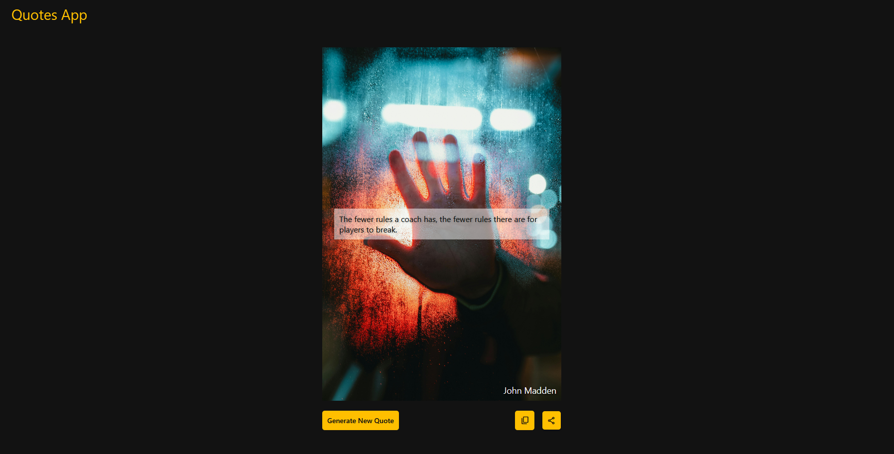

# About Quote Generator App
## Introduction
Welcome to the Github repository for **Quote Generator**. A simple web-based Quote Generator that allows users to generate random quotes, copy them to their clipboard, and share them on Twitter.
## Features
- **Generate New Quotes** – Click the "Generate New Quote" button to fetch a new random quote.
- **Copy to Clipboard** – Click the "Copy" button to copy the quote for use in a notepad or anywhere else.
- **Share on Twitter** – Click the "Share" button to open Twitter with the quote pre-filled in a tweet.
## How to Use
- Open the Quote Generator in your web browser.
- Click the "Generate New Quote" button to get a new quote.
- Click the "Copy" button to copy the quote to your clipboard.
- Click the "Share" button to open Twitter with the quote, ready to post.
## Screenshots
Here's how the app looks:
- Home Page

## Technologies used:
- HTML (Structure)
- CSS (Styling)
- JavaScirpt (Functionality & API Handling)